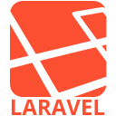

<h2 align="center">Hi there 👋, I'm Sertxu Developer</h2>
<h3 align="center">A Full Stack Developer & SysAdmin 💻</h3>
 

I have been programming mainly with PHP for +10 years 😅, but I have also done some projects using JavaScript and Shell, among others.

Currently, I create websites and SaaS using the <a href="https://tallstack.dev/" target="_blank">TALL Stack</a>.

<h4 align="center">Don't forget to check my <a href="https://sertxu.dev" target="_blank">website</a>!</h4>

 

<h4 align="center">These are some of the languages and frameworks I have used</h4>
 

 

 

<h4 align="center">These are some of the software I have used</h4>
 

 

<h4 align="center">Links of interest</h4>
 

